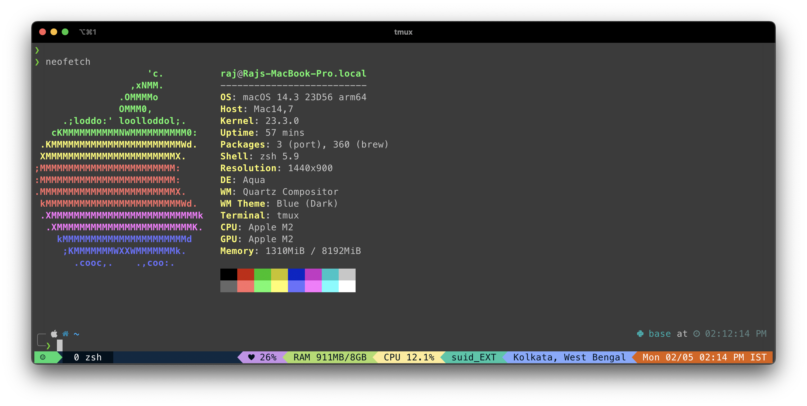

#### Theme 1 - Preview 



Pretty Tmux config

### Install
MacOs
```bash
brew install tmux
```
Linux
```bash
sudo apt-get install tmux
```
Install using tpm 
```bash
git clone https://github.com/tmux-plugins/tpm ~/.tmux/plugins/tpm
```

If you are a tpm user, you can install the theme and keep up to date by adding the following to your .tmux.conf file:
```
set -g @plugin 'tmux-plugins/tpm'
set -g @plugin 'tmux-plugins/tmux-sensible'
set -g @plugin 'kylepeeler/tmux-nightowl'
set -g @nightowl-border-contrast true
set -g @nightowl-cpu-usage true
set -g @nightowl-ram-usage true
set -g @nightowl-show-powerline true

set -g mouse on

run -b '~/.tmux/plugins/tpm/tpm'
```
- Use the tpm install command: prefix + I (default prefix is ctrl+b)
- so : Crtl + b , then I together press it will install the theme


#### Theme 2 - Preview


#### Install
Install Tmux first
```
$ brew install tmux

$ git clone https://github.com/tmux-plugins/tpm ~/.tmux/plugins/tpm
```
now onto themeing

```bash
$ git clone https://github.com/gpakosz/.tmux
$ cp .tmux/.tmux.conf ~
```
now one more step
```bash
$ git clone https://github.com/Optixal/tmux-dracula
$ cp tmux-dracula/.tmux.conf.local ~
$ sudo reboot
```

## NvChad
if you have any prev nvim config remove em , in Mac

```
$ sudo rm -r ~/.local/share/nvim/
​```
#### Install NvChad

```
$ git clone https://github.com/NvChad/NvChad ~/.config/nvim --depth 1 && nvim
```


